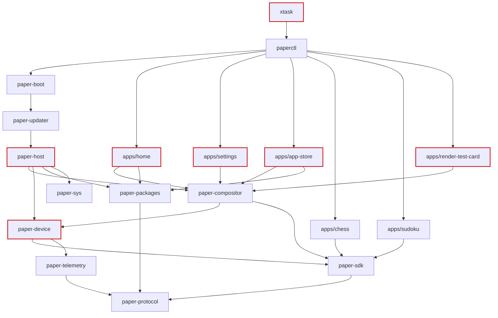
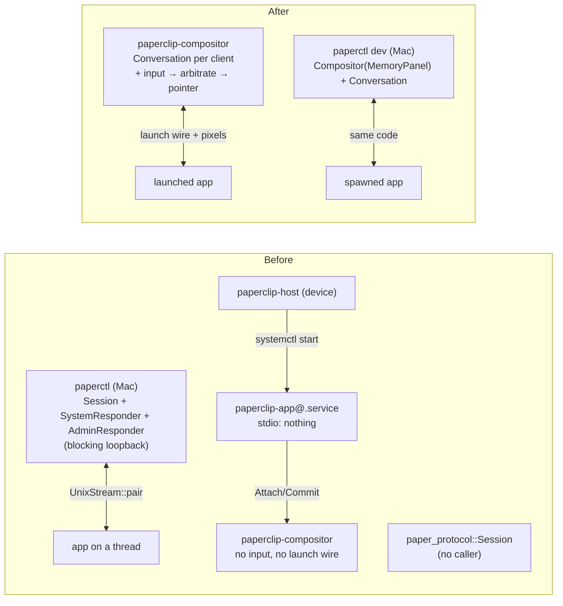

# Architecture review — where the seams belong, which core libs should exist, and how the workspace scales

**Date:** 2026-09-18 · **Ticket:** WWW-91 · **Tree reviewed:** `main` at `be4d52a`
(WWW-84) · **Status:** proposal. Nothing in the Rust tree changed in this run;
an accepted candidate becomes its own ticket.

This review is dated rather than numbered because it is superseded, not
referenced: a later review replaces it. ADRs record what was decided; this
records what should be decided next, with the evidence.

## Scope and what was read

- `CONTEXT.md`; the ADR index and, in full, ADR-0001, 0012, 0016, 0022, 0025,
  0028, 0033, 0037, 0039 and 0040 — the decisions behind the crates that moved
  most recently. `AGENTS.md`, `docs/agents/*`, `docs/development.md`.
- `git log --oneline -n 150`. Files touched most often in the last 60 commits:
  `tools/paperctl/src/upgrade.rs` (7), `tools/paperctl/src/error.rs` (7),
  `tools/paperctl/src/lib.rs` (6), `platform/compositor/src/lib.rs` (6),
  `platform/host/src/linux/runtime.rs` (5), `xtask/src/plan_release.rs` (5),
  `platform/compositor/src/server.rs` (4), and the rest of `tools/paperctl`.
  The compositor, the host supervisor, `paperctl` and the updater are where
  change lands; they got the depth.
- Every crate's `Cargo.toml`, and `cargo tree -e normal` for each platform
  crate and each app, so the dependency edges below are the resolver's, not
  the manifests' intentions.
- The code itself, at the lines cited. Every excerpt below is quoted from the
  tree as it exists at `be4d52a`.

Vocabulary is `codebase-design`'s: **module**, **interface**, **depth**,
**seam**, **adapter**, **leverage**, **locality**. The bar every candidate
passed: the deletion test, the two-adapter rule, and "would you page someone
for it". Candidates that failed are listed once each under [Also seen](#also-seen).

### The workspace by size

| Crate | Lines of `.rs` | `#[test]` | Kind (ADR-0001 terms, as built) |
|---|---:|---:|---|
| `tools/paperctl` | 11,492 | 108 | leaf that links everything |
| `platform/packages` | 10,421 | 156 | mechanism |
| `platform/device` | 7,603 | 121 | mechanism |
| `platform/host` | 6,390 | 51 | mechanism |
| `platform/compositor` | 4,812 | 72 | mechanism, plus a client half |
| `platform/updater` | 4,397 | 34 | mechanism |
| `platform/sdk` | 4,356 | 65 | core lib for apps |
| `platform/protocol` | 4,058 | 80 | core lib |
| `apps/app-store` | 3,254 | 33 | leaf |
| `apps/settings` | 2,417 | 41 | leaf |
| `apps/render-test-card` | 2,017 | 32 | leaf |
| `apps/chess`, `apps/sudoku` | 1,988 / 1,905 | 32 / 32 | leaf |
| `apps/chess-rules`, `apps/sudoku-rules` | 1,439 / 1,925 | 38 / 44 | core lib (one app each) |
| `apps/home` | 1,112 | 24 | leaf |
| `platform/sys` | 1,031 | 17 | mechanism (seven traits) |
| `platform/boot` | 1,003 | 19 | mechanism |
| `platform/testing`, `platform/telemetry` | 792 / 766 | 18 / 8 | fakes / sink |
| `xtask` | 1,561 | 23 | tool |
| `tests/*`, `sdk-examples/*`, `tools/fault-app` | 5,190 | 65 | tests |

### The dependency graph the resolver actually builds



Four edges are the wrong way round or heavier than they look, and three of the
seven candidates come straight from them:

- **Every default app depends on `paper-device`.** `apps/home`,
  `apps/settings`, `apps/app-store` and `apps/render-test-card` link
  `paper-compositor` for the client half of its wire, and `paper-compositor`
  links `paper-device` for the server half. `cargo tree -p paper-home` lists
  `paper-device`. ADR-0022 verified the opposite ("carries no `paper-device`
  edge", its line 180) and ADR-0039 quietly reversed it. → [Candidate 2](#candidate-2--split-the-compositor-client-from-the-compositor-server).
- **`paper-host` depends on `paper-compositor` for one string constant**
  (`platform/host/src/units.rs:659`, `paper_compositor::SOCKET_ENV`), which
  pulls the compositor, `libc::poll`, `mmap` and the panel into the
  supervisor, the updater and the boot launcher. → [Candidate 2](#candidate-2--split-the-compositor-client-from-the-compositor-server).
- **`paper-device` depends on `paper-sdk`** (`platform/device/Cargo.toml:24`)
  to get a pixel buffer. The tablet adapter sits above the app convenience
  layer. → [Candidate 6](#candidate-6--paper-canvas-a-core-lib-for-the-rasteriser).
- **`xtask` depends on `paperctl`** (`xtask/src/docs.rs:60`, for
  `Cli::command`), so `cargo xtask new-adr` builds every app. → [Also seen](#also-seen).

## Summary of candidates

| # | Candidate | What kind of change | Strength | Axes it argues on |
|---|---|---|---|---|
| 1 | [`paper-session`: the host side of one app connection, as a sans-I/O `Conversation`](#candidate-1--paper-session-the-host-side-of-one-app-connection) | new crate (mechanism) | **Strong** | building the right thing; testable not mockable; developer experience |
| 2 | [Split the compositor client from the compositor server](#candidate-2--split-the-compositor-client-from-the-compositor-server) | crate split (`paper-compositor-client`, mechanism) + a `paper_protocol::compositor` module | **Strong** | dependency graph at 3×; correctness of the ADR record |
| 3 | [One `UnitControl`: five shapes of "talk to systemd" become one trait with two adapters](#candidate-3--one-unitcontrol) | seam consolidation in `paper-host`, `paper-updater`, `paper-sys` | **Strong** | testable without a VM; locality of a safety-critical ordering |
| 4 | [`FrameReader` moves into `paper_protocol::codec`](#candidate-4--framereader-moves-into-paper_protocolcodec) | small deepening | Worth exploring (Strong once #1 lands) | one framing implementation |
| 5 | [`paperctl` stops linking apps; `dev` and `run` spawn the entrypoint](#candidate-5--paperctl-stops-linking-apps) | seam move (depends on #1) | **Strong** | 3× apps: registration sites; build graph |
| 6 | [`paper-canvas`: a core lib for the rasteriser](#candidate-6--paper-canvas-a-core-lib-for-the-rasteriser) | new crate (core lib) | Worth exploring | dependency direction; partly taste, and says so |
| 7 | [Delete `paper_sys::Storage`](#candidate-7--delete-paper_sysstorage) | deletion | Strong (small) | the earn-it bar applied to an existing seam |

[How this holds at 3×](#how-this-holds-at-3) names what breaks first.
[Top recommendation](#top-recommendation) says which to do first and why.

---

## Candidate 1 — `paper-session`: the host side of one app connection

### Name

Crate `platform/session`, library `paper_session`, a **mechanism**. Its one
deep type is `Conversation`.

**This introduces vocabulary.** *Conversation* — the host side of one
Session's launch-time exchange: which message is legal next, what the host
sends, and what the app just did. It belongs in `CONTEXT.md` when this is
accepted. The glossary's **Session** ("a running foreground program that the
host supervises") is untouched; `tools/paperctl/src/session.rs`'s
`Session` type has been using the glossary word for the conversation, and this
candidate ends that. The word is not new to the code:
`platform/protocol/src/session.rs:5-7` already says "a host message that would
be illegal at this point in the conversation cannot be constructed".

Two names were close. `Session` (keep paperctl's name, promote it) loses
because it collides with the glossary and with `paper_protocol::Session`,
which is the rules this type wraps. `AppLink` says what it is made of, not
what it guarantees. `Conversation` describes the invariant — an ordered,
legal exchange — and is the protocol crate's own word.

### Files

- `tools/paperctl/src/session.rs:159` (`struct Session`), `:243-290`
  (`request_frame`), `:624-635` (the handshake and construction),
  `:52-57` (`LiveSystemResponder`), `:1-24` (module doc: "the one real process
  that plays host").
- `tools/paperctl/src/system.rs:74` (`SystemResponder`), `tools/paperctl/src/admin.rs`
  (`AdminResponder`).
- `platform/protocol/src/session.rs:1-17` (module doc), `:161`
  (`pub struct Session`), `:220` (`on_app_message`), `:317` (`draw`).
- `platform/compositor/src/server.rs:269` (`Compositor`), `:413` (`run_once`),
  `:591` (`service_client`), `:126` (`FrameReader`);
  `platform/compositor/src/wire.rs:72` (`HostEvent`).
- `platform/compositor/src/gesture.rs:154` (`GestureDetector::arbitrate`),
  `platform/compositor/src/chrome.rs:97` (`ChromeState::apply_event`).
- `platform/host/src/units.rs:624` (`ExecStart={root}/apps/%i/bin/%i`),
  `platform/host/src/linux/runtime.rs:806`
  (`compositor_reports_a_client_foreground`).

### Problem

Three facts, each checked against the tree.

**The only host that speaks the launch wire lives inside the CLI, and it
ignores the rules.** `Session::request_frame` writes a `Draw`, reads until a
`Frame`, and answers `SystemQuery`s inline (`session.rs:243-290`). It never
constructs a `paper_protocol::Session`. That state machine — "the host's side
of one app connection… both the validator for everything the app says and the
*factory* for everything the host says" (`platform/protocol/src/session.rs:3-5`)
— has no production caller anywhere: `grep` finds `Session::start` in
`apps/settings/src/app.rs`'s tests and nothing else. 746 lines of vocabulary
that nothing drives. A conversation whose rules and whose driver are in
different crates and never meet is the definition of no locality.

**On the device, nothing speaks the wire to an app at all.** ADR-0039 says so:
"`paperclip-app@.service`'s `ExecStart=` starts the binary directly, with
nothing on the other end of its stdio." The compositor's own wire carries
pixels one way — `ClientRequest::{Attach, Commit}` — and exactly one event
back:

```rust
// platform/compositor/src/wire.rs:72
pub enum HostEvent {
    Released(BufferSlot),
}
```

No pointer, no `Draw`, no lifecycle. `GestureDetector::arbitrate` (621 lines,
ADR-0034) and `ChromeState` (363 lines, ADR-0035) have no caller outside their
own tests; `Compositor::sleep`/`wake` are called only from
`platform/compositor/tests/sleep_and_lock.rs`. The compositor has no input
path, so it has nothing to arbitrate and no frame to compose chrome onto.
These are pipelines with nothing upstream — the shape ADR-0025 named as its
own failure mode for `diagnostic::record`.

**The move was already predicted.** ADR-0028: "If `platform/host` ever becomes
the process that actually drives live app sessions… `SystemResponder` and
`AdminResponder` both move there and `tools/paperctl/src/system.rs`/`admin.rs`
become the desktop-preview-only copies." ADR-0039 leaves "A real host process
piping `Hello`/`Draw` to a launched app on the device" open.

So the concept *drive one app's conversation* is spread across `paperctl` (the
only implementation, behind the `apps` feature the device build turns off),
`paper_protocol::session` (the rules, unused) and the compositor (where it must
run on the device, and is absent). Understanding it means five files in three
crates. Testing it means a thread, a `UnixStream::pair()` and a read timeout
(`session.rs:727-771`, `hung_session`). The seam is in the wrong place.

### Before

```rust
// tools/paperctl/src/session.rs:243
    pub(crate) fn request_frame(
        &mut self,
        reason: DrawReason,
    ) -> Result<Option<Request>, SessionError> {
        for event in self.system.changes() {
            codec::write_message(&mut self.host, &HostMessage::SystemEvent(event))?;
        }
        let frame = self.next_frame;
        self.next_frame = self.next_frame.next();
        codec::write_message(
            &mut self.host,
            &HostMessage::Draw(DrawRequest {
                frame,
                reason,
                viewport: SCREEN,
            }),
        )?;
        let mut request = None;
        loop {
            match codec::read_message::<_, AppMessage>(&mut self.host)? {
                AppMessage::Frame(_) => return Ok(request),
                AppMessage::Request(seen) => request = Some(seen),
                AppMessage::SystemQuery(query) => {
                    /* … answers Admin via self.admin, everything else via
                       self.system, writes a SystemAnswer … */
                }
                AppMessage::Diagnostic(diagnostic) => {
                    eprintln!("paperctl: [app] {diagnostic:?}");
                }
                AppMessage::Ready(_) | AppMessage::Saved(_) => {}
                // Non-exhaustive: a message this build has never heard of is
                // safely ignorable here, same as an unknown `Request`.
                _ => {}
            }
        }
    }
```

```rust
// tools/paperctl/src/session.rs:624
    codec::write_message(&mut host, &HostMessage::Hello(hello))?;
    let _ready: AppMessage = codec::read_message(&mut host)?;

    let mut session = Session {
        host,
        next_frame: FrameId::FIRST,
        shared,
        damage: damage_slot,
        app_thread,
        app_id: manifest.id().clone(),
        system: LiveSystemResponder::new(),
        admin: AdminResponder::new(Layout::from_environment()),
    };
```

Note `let _ready: AppMessage = …` — whatever arrives is accepted as `Ready`.
`paper_protocol::Session::on_app_message` would refuse anything else with
`Violation::BeforeReady`. The rules exist; this is the call site that does not
use them.

### After

The interface is **sans-I/O**: bytes and decoded messages go in, encoded
messages and events come out, and every deadline is arithmetic on an `Instant`
the caller supplies. The protocol crate's own rule holds — "a state machine
that also owned a clock would be a state machine that could not be tested
without one" — and it now extends to sockets.

```rust
// platform/session/src/lib.rs  (paper_session)
/// The host side of one Session's launch-time exchange. Owns the rules
/// (`paper_protocol::Session`), frame ids, framing, the outbox, and the
/// answers to `SystemQuery`. Owns no socket and no clock.
pub struct Conversation { /* rules, FrameReader, VecDeque<Vec<u8>>, Box<dyn Answers>, deadlines */ }

/// The one injected seam. Two adapters: `LiveAnswers` (paper_sys backends and
/// the package store — paperctl's system.rs and admin.rs, moved) and
/// `paper_testing::ScriptedAnswers`.
pub trait Answers: fmt::Debug {
    fn system(&mut self, query: &SystemQuery, now: Instant) -> SystemAnswer;
    fn admin(&mut self, caller: &AppId, query: AdminQuery) -> Result<AdminValue, SystemDenial>;
}

#[non_exhaustive]
pub enum Event { Ready, Frame { id: FrameId, damage: Damage }, Request(Request), Diagnostic(Diagnostic), Saved { ok: bool } }
#[non_exhaustive]
pub enum Await { Ready, Frame(FrameId), Saved }
#[non_exhaustive]
pub enum Fault { Violation(Violation), Codec(CodecError), Overdue(Await) }

impl Conversation {
    /// Queues `Hello`; `now` starts the ready budget. Nothing exists before this.
    pub fn open(hello: Hello, answers: Box<dyn Answers>, now: Instant) -> Self;

    // Inbound — the only two ways an app message enters.
    /// For poll loops: raw bytes, any framing boundary. Queries are answered
    /// inside and never surface as events.
    pub fn feed(&mut self, bytes: &[u8], now: Instant) -> Result<Vec<Event>, Fault>;
    /// For blocking loops that already decoded a frame.
    pub fn receive(&mut self, message: AppMessage, now: Instant) -> Result<Option<Event>, Fault>;

    // Host intents — refused by the rules or queued to the outbox.
    pub fn draw(&mut self, reason: DrawReason, now: Instant) -> Result<FrameId, Violation>;
    pub fn pointer(&mut self, event: PointerEvent) -> Result<(), Violation>;
    /// A battery or network change. The loop decides how often it looks;
    /// the conversation only orders it before the next `Draw`.
    pub fn push(&mut self, event: SystemEvent);
    pub fn suspend(&mut self) -> Result<(), Violation>;
    pub fn resume(&mut self) -> Result<(), Violation>;
    pub fn prepare_to_exit(&mut self, reason: ExitReason, now: Instant) -> Result<(), Violation>;
    pub fn close(&mut self);                                     // queues Goodbye; Closed

    // Outbound.
    pub fn pending_write(&self) -> bool;                         // arm POLLOUT on this
    pub fn write_to(&mut self, sink: &mut impl Write) -> io::Result<()>;   // WouldBlock keeps the tail
    pub fn overdue(&self, now: Instant) -> Option<Await>;        // READY_DEADLINE / EXIT_DEADLINE arithmetic
    pub fn state(&self) -> paper_protocol::State;
}

pub mod blocking {
    /// Flush the outbox, then `read_message` → `receive` until `until` arrives.
    pub fn pump(c: &mut Conversation, io: &mut (impl Read + Write), until: Await)
        -> Result<Vec<Event>, Fault>;
}
```

Invariants the interface promises: at most one `Draw` outstanding, and a
second `draw` is refused by the rules (`paper_protocol::Session::draw` already
returns `HostFault` for it); `push`ed `SystemEvent`s go out before the next
`Draw`, preserving the ordering `session.rs:247` has today; any `Err` latches
`Closed` and later calls return `Violation`; a query is answered inside and a
caller never sees one.

**Call site (a): `paperctl run`, blocking, replaces `session.rs:560-639` and `:243-290`.**

```rust
let (mut host, app_side) = UnixStream::pair()?;
host.set_read_timeout(Some(READ_TIMEOUT))?;                      // the timeout stays with the socket
let app_thread = spawn(app_side.try_clone()?, app_side, surfaces);
let mut talk = Conversation::open(hello, Box::new(LiveAnswers::from_environment()), Instant::now());
blocking::pump(&mut talk, &mut host, Await::Ready)?;
let id = talk.draw(DrawReason::First, Instant::now())?;
blocking::pump(&mut talk, &mut host, Await::Frame(id))?;

// per pointer event (was `pointer` then `request_frame`):
talk.pointer(event)?;
let id = talk.draw(DrawReason::AppRequested, Instant::now())?;
let request = blocking::pump(&mut talk, &mut host, Await::Frame(id))?
    .into_iter()
    .find_map(|event| match event { Event::Request(r) => Some(r), _ => None });
```

**Call site (b): the compositor, beside `service_client` at `server.rs:591`.**

```rust
fn service_app(&mut self, id: ClientId, events: &mut Vec<CompositorEvent>) {
    let now = Instant::now();
    let Some(client) = self.clients.get_mut(&id) else { return };
    let mut chunk = [0u8; 8192];
    let read = match (&client.stream).read(&mut chunk) {
        Ok(0) => return self.disconnect(id, events),
        Ok(n) => n,
        Err(e) if e.kind() == io::ErrorKind::WouldBlock => 0,
        Err(_) => return self.disconnect(id, events),
    };
    match client.talk.feed(&chunk[..read], now) {
        Ok(new) => for event in new { match event {
            Event::Frame { damage, .. } => self.present(id, damage, events),
            Event::Request(request) => events.push(CompositorEvent::Request(id, request)),
            Event::Saved { .. } => self.disconnect(id, events),
            _ => {}
        } },
        Err(fault) => { tracing::warn!(?fault, "ending the conversation"); self.disconnect(id, events); }
    }
    if client.talk.write_to(&mut &client.stream).is_err() { self.disconnect(id, events) }
}
// run_once: POLLOUT iff talk.pending_write(); after poll, disconnect any client whose
// talk.overdue(now) is Some. Input: self.foreground().talk.pointer(event) after
// GestureDetector::arbitrate says Verdict::App — arbitrate gets its first caller.
```

Before and after, as processes:



### Options

Three interfaces were designed independently under different constraints
(`codebase-design`'s design-it-twice), then compared on depth, locality and
seam placement.

**Option A — one door.** `advance(Input, now, &mut Vec<HostMessage>) ->
Result<Option<Event>, Ended>` with an `Input` enum
(`App(AppMessage) | Draw | Pointer | Suspend | Resume | PrepareToExit`), plus
`open` and `deadline`. Three entry points. *Why it lost:* the caller still
frames bytes and encodes the out-param, which is exactly the part that differs
between a blocking write and a `POLLOUT` queue — the compositor keeps its
private `FrameReader` and the SDK's reader thread keeps `read_message`, so two
framing paths remain. Its `Backends<P, N, W, S>` puts four type parameters on
every holder, including the compositor's `Client`.

**Option B — intent methods, chained responders.** A method per host intent,
`outbound()`/`events()` draining iterators, `Vec<Box<dyn Responder>>` where
the first `Some` wins, and `expire(now)` as a mutating input. *Why it lost:*
the responder chain is a third adapter for a seam that has two tiers, and
admin identity-gating becomes an ordering property of a vector rather than a
typed rule — ADR-0028's distinction between "the question was refused"
(`SystemDenial`) and "the transaction failed" (`AdminError`) is what a
first-`Some`-wins chain blurs. `expire` as a mutation also means the poll loop
cannot compute one timeout for N conversations without touching each.

**Option C — owns framing and the outbox** (the shape above). `feed(bytes)`
for poll loops, `receive(message)` for blocking ones, `write_to(sink)` that
keeps a partial write, `overdue(now)` as a pure query, and a twenty-line
`blocking::pump`. *Why it won:* framing lives once (see
[Candidate 4](#candidate-4--framereader-moves-into-paper_protocolcodec)), the
blocking and non-blocking callers share every rule and differ only in who
calls `read`, and a test constructs it in one line and never opens a socket.
Its honest weakness, inherited by the recommendation: the compositor's pixel
wire (`ClientRequest`/`HostEvent`) survives beside the launch wire, so a device
app speaks two protocols on two fds until a later decision unifies them.

**Where the driver runs on the device** is a separate choice with three shapes:

- *In the compositor process.* It already has the poll loop, the `Foreground`,
  the per-client `FrameReader`, and — once input lands — the pointer stream.
  The conversation is what connects those. **Recommended.**
- *In the supervisor (`paperclip-host`).* Lost on ADR-0012 decision 3 and its
  own "what would make this wrong": "Real IPC between host and apps… A socket
  the recovery path depends on would undo decision 3. The rule to keep:
  `paperctl stock` must work when everything else is dead." The supervisor's
  watchdog is the safety backstop; app I/O must not share its liveness.
- *A third long-running process.* Lost on cost: another unit, status file,
  readiness rung and watchdog, for a process whose only job is to sit between
  two processes that already have to agree on who is foreground.

### Recommendation

Option C, running in the compositor on the device and in `paperctl dev`/`run`
on the Mac. One trait (`Answers`) with two adapters, no generics on the holder,
framing owned once, deadlines as arithmetic. Reasoning: this is the shape where
the interface *is* the test surface — every conversation test becomes
`Conversation::open(hello, Box::new(ScriptedAnswers::default()), t0)`, feed
`AppMessage` values, assert on the bytes `write_to` produces and the `Event`s
returned — and the only shape where the compositor gets the launch wire
without growing a second, ad-hoc driver next to `paperctl`'s.

Two follow-on decisions are deliberately *not* made here: unifying the two
wires (ADR-0033 left it open; keep it open until a real app runs through both
on the device), and whether `Answers::system` should stop doing I/O on the
compositor's thread (`SystemResponder` shells out to `nmcli` today,
`tools/paperctl/src/system.rs:20`; `push` exists so the loop can move that
polling off the hot path when a frame time shows it).

### Benefits

- **Leverage.** One implementation serves the CLI loopback, the device
  compositor, and the conformance suite (which "builds bytes by hand and never
  calls an SDK function", ADR-0016 — it becomes the natural home for
  `Conversation`'s wire tests).
- **Locality.** The rules (`paper_protocol::Session`) get their first
  production caller; the `Ready`/`Saved` deadlines, frame-id allocation, the
  admin gate and the "unknown message is ignorable" policy stop being facts
  spread across `session.rs`, `system.rs`, `admin.rs` and the compositor.
- **Tests.** `hung_session` (`session.rs:727`) — a thread that sleeps an hour
  to prove a ten-second timeout — becomes `assert_eq!(talk.overdue(t0 + 11s),
  Some(Await::Frame(id)))`. `every_runnable_app_opens_a_real_session_and_draws_something`
  (`session.rs:794`) stays, as the one integration test. That is the
  "fewer, deeper tests" trade the review skill asks to be named.
- **The compositor's dormant work becomes reachable.** `arbitrate`, `ChromeState`,
  `sleep`/`wake` all get a loop to live in.

### Cost

- A new crate; `session.rs`, `system.rs` and `admin.rs` (about 1,600 lines)
  move out of `paperctl`, and the `apps` feature shrinks
  ([Candidate 5](#candidate-5--paperctl-stops-linking-apps) finishes that).
- The compositor grows a write queue and `POLLOUT` handling it does not have
  today (`notify_release` at `server.rs:794` is a best-effort write with no
  queue, by ADR-0037's own admission).
- An input path for the compositor: `paper_device::input`'s decoders
  (`TouchDecoder`, `PenDecoder`, `reader::drive`) exist and are driven today
  only by `paperctl run`'s `spawn_input_readers` (`tools/paperctl/src/run.rs:459`).
  They need a poll-friendly source in the compositor. That is device work under
  the project's review exception.
- **Nothing here is device qualification.** This makes the on-device test
  writable; it does not pass it.

### Strength

**Strong.** It is the missing piece ADR-0039 names, it turns unused vocabulary
into the production path, and it is the prerequisite for Candidate 5.

### ADR

Extends ADR-0028's own prediction. Keeps ADR-0012 decision 3 (the supervisor
stays socket-free). Does not reopen ADR-0033/0037's two-wire decision — it
makes the driver wire-agnostic so that decision can wait for evidence.

---

## Candidate 2 — Split the compositor client from the compositor server

### Name

- Crate `platform/compositor-client`, library `paper_compositor_client`, a
  **mechanism** (an adapter at the SDK's `SurfaceProvider` seam, plus the
  shared-memory pool and fd passing it needs). Not new vocabulary: ADR-0039's
  own phrase is "ordinary compositor clients".
- Module `paper_protocol::compositor` holding the wire enums (`ClientHello`,
  `ClientRequest`, `ClientRole`, `HostEvent`) and the two constants
  (`SOCKET_ENV`, `DEFAULT_SOCKET`). The protocol crate "owns the vocabulary,
  not just the version" (ADR-0016); a wire two of our processes share is
  vocabulary.

Names considered and rejected: `paper-surface` (the SDK already has `Surface`
and `LocalSurfaces`; the crate is one adapter for that seam, not the seam),
`paper-shm` (names the mechanism, hides the role).

### Files

- `apps/home/src/main.rs:38`, `apps/settings/src/main.rs:21`,
  `apps/app-store/src/main.rs:38`, `apps/render-test-card/src/main.rs:17`
  (`use paper_compositor::{ClientRole, CompositorSurfaces, socket_path};`).
- `platform/host/src/units.rs:659` (`socket_env = paper_compositor::SOCKET_ENV`).
- `platform/compositor/src/lib.rs:61-71` (eleven modules, one crate);
  `platform/compositor/Cargo.toml` (`paper-device`, `paper-sdk`, `libc`).
- `platform/compositor/src/client.rs:78` (`SOCKET_ENV`), `:91` (`socket_path`).
- `docs/adr/0022-app-entrypoint-binaries-and-stdio-transport.md:180`
  ("Verified: `cargo tree -p paper-home -p paper-app-store -p paper-settings`
  carries no `paper-device` edge").

### Problem

`paper-compositor` is two modules with different dependency profiles in one
crate. The server half (`server`, `present`, `stopped`, `sleep`, `chrome`,
`gesture`) needs `paper-device` for `Panel`, `MemoryPanel` and
`VendorPanel::open`, and `libc::poll`. The client half (`client`, `pool`,
`fdpass`, `wire`) needs `mmap`, `sendmsg` and the SDK's `Surface` traits.
Apps need only the client half. Because they are one crate, every default app
now links `paper-device`:

```text
$ cargo tree -p paper-home -e normal --prefix none | grep '^paper' | sort -u
paper-compositor   paper-device   paper-home   paper-packages
paper-protocol     paper-sdk      paper-telemetry
```

ADR-0022 recorded the opposite as a verified fact, and ADR-0039 reversed it
without saying so. The `clippy-device` and `check-device` gates cannot notice:
the code compiles. What is lost is what the edge was protecting — an app
binary that cannot, by construction, open the panel — and, at 3× apps, that
`server.rs` (a top-five churn file) recompiles every default app on every
change.

The host's edge is stranger. `paper-host` links `paper-compositor` for one
`&str` (`units.rs:659`), and through it the supervisor, the updater and the
boot launcher all compile the panel and the poll loop.

### Before

```rust
// apps/home/src/main.rs:38
use paper_compositor::{ClientRole, CompositorSurfaces, socket_path};
```

```rust
// platform/host/src/units.rs:659
        socket_env = paper_compositor::SOCKET_ENV,
```

```toml
# platform/compositor/Cargo.toml
[dependencies]
paper-device = { workspace = true }
paper-protocol = { workspace = true }
paper-sdk = { workspace = true }
paper-telemetry = { workspace = true }
```

### After

```toml
# apps/home/Cargo.toml
[dependencies]
paper-compositor-client = { workspace = true }   # was paper-compositor
paper-packages = { workspace = true }
paper-sdk = { workspace = true }
```

```rust
// apps/home/src/main.rs
use paper_compositor_client::{CompositorSurfaces, socket_path};
use paper_protocol::compositor::ClientRole;
```

```rust
// platform/host/src/units.rs — paper-host no longer depends on paper-compositor
        socket_env = paper_protocol::compositor::SOCKET_ENV,
```

```text
platform/
  compositor-client/   paper_compositor_client: client, pool, fdpass   (unsafe, libc, paper-sdk)
  compositor/          paper_compositor: server, present, stopped, sleep, chrome, gesture
                       depends on paper-compositor-client for Pool and the wire
platform/protocol/src/compositor.rs   ClientHello, ClientRequest, ClientRole, HostEvent,
                                      SOCKET_ENV, DEFAULT_SOCKET
```

### Options

**Option A — feature-gate the server in the same crate.** `server = ["dep:paper-device"]`,
apps use `default-features = false`. *Why it lost:* Cargo unifies features
across a build. `cargo clippy --workspace --all-targets` and `cargo test
--workspace` — the CI gates — enable `server` for everyone the moment one
crate asks for it, so `cargo tree` and the gates cannot see the discipline,
which is exactly the evidence ADR-0022 relied on. A guarantee the gates cannot
observe is not one.

**Option B — a separate client crate, wire in the protocol crate** (above).
*Why it won:* the laziest shape that holds. The dependency edge is visible to
`cargo tree`, to `clippy-device`, and to a reader of `Cargo.toml`.

**Option C — fold the client into `paper-sdk` behind a `compositor` feature.**
*Why it lost:* the SDK gains `unsafe` `mmap`/`sendmsg` and `libc` for every
app, including Chess and Sudoku which are not compositor clients (ADR-0039
left them on `LocalSurfaces` on purpose); and the server needs `Pool` too, so
the server would depend on the SDK for its own pool — the arrow points the
wrong way.

### Recommendation

Option B. Move `wire.rs` and the two constants into `paper_protocol::compositor`
first (one commit, no behaviour change, closes the ADR-0033 question of
"where does the second wire live" without merging it into the closed enums);
then split the crate. `paper-host`'s dependency on `paper-compositor` goes in
the same change.

### Benefits

- **3×:** a server change recompiles the server; an app change recompiles the
  app. The default apps' `cargo tree` stops listing `paper-device`, and the
  claim ADR-0022 made becomes true again and checkable.
- **Locality:** the four `unsafe` modules (`fdpass`, `client`, `server`,
  `pool`) split into three client-side and one server-side, each with its
  written reason, in a crate small enough to audit whole.

### Cost

One new crate, one new protocol module, eight `Cargo.toml` edits, four
`main.rs` import lines, and ADR-0022/0039 each get a one-paragraph amendment
recording the reversal and its repair. No behaviour changes.

### Strength

**Strong.** It is cheap, it fixes a record that is currently wrong, and it is
the one candidate whose cost grows with every app that is added before it is
done.

### ADR

Amends ADR-0022 (the verified claim) and ADR-0039 (which broke it). Consistent
with ADR-0033/0037: the wire stays distinct from `HostMessage`/`AppMessage`;
it only moves crates.

---

## Candidate 3 — One `UnitControl`

### Name

No new vocabulary. `paper_sys::UnitControl` (the trait, `platform/sys/src/unit.rs:36`)
is the name that survives. The other four shapes go, or become adapters of it.

### Files

- `platform/sys/src/unit.rs:36-71` (`trait UnitControl`, seven methods),
  `:106` (`Systemctl<P: Process>`); `platform/testing/src/sys.rs:164`
  (`FakeUnitControl`).
- `platform/host/src/linux/systemd.rs:67` (`struct Systemd`, twelve methods
  `:98-244`, shells out itself).
- `platform/host/src/linux/unit.rs:28` (`struct UnitControl` — a struct with
  the trait's name — `:58` `impl ServiceControl for UnitControl`).
- `platform/device/src/stock.rs:54` (`trait ServiceControl`, per-unit,
  `&mut self`, no `kill`, no `restart`); `platform/testing/src/service_control.rs:20`
  (`FakeServiceControl`).
- `platform/updater/src/health.rs:115` (`trait SessionControl`);
  `platform/updater/src/linux.rs:28,53,76` (`SystemdSession` holds a
  `Systemd`).
- `platform/host/src/linux/recovery.rs:40-41, 190-217` (`StockRecovery` holds a
  `Systemd` *and* builds a `unit::UnitControl`).
- `platform/host/src/linux/runtime.rs:24, 228-244` (`PaperclipUnits` over
  `Box<dyn paper_sys::UnitControl>` — already migrated, WWW-46).
- `platform/host/src/lib.rs:53` (`#[cfg(target_os = "linux")] pub mod linux;`).

### Problem

"Talk to systemd" has five shapes in three crates:

| Shape | Where | Adapters | Tested on a Mac? |
|---|---|---|---|
| `paper_sys::UnitControl` trait | `sys/unit.rs:36` | `Systemctl`, `FakeUnitControl` | yes |
| `paper_host::linux::systemd::Systemd` struct | `host/linux/systemd.rs:67` | itself | no — `linux` module is `cfg(target_os = "linux")` |
| `paper_host::linux::unit::UnitControl` struct | `host/linux/unit.rs:28` | itself | no |
| `paper_device::stock::ServiceControl` trait | `device/stock.rs:54` | `unit::UnitControl`, `FakeServiceControl`, two local fakes in `takeover.rs` | yes |
| `paper_updater::SessionControl` trait | `updater/health.rs:115` | `SystemdSession`, a fake | yes, but `SystemdSession` itself no |

The runtime (`PaperclipUnits`) was moved onto the trait by WWW-46 and its four
tests use `FakeUnitControl` (`runtime.rs:1013-1090`). The two callers that
matter most for safety were not: `StockRecovery::restore` — "the advisory
locks are cleared only while stock is confirmed down… the wakelock is released
only after stock is confirmed up" (`recovery.rs:22-30`) — and the updater's
`stand_down`/`bring_up`. Both hold a concrete `Systemd` that shells out, and
both live under `cfg(target_os = "linux")`, so on the Mac they do not compile,
let alone run. Their ordering is proven only by the VM harness (ADR-0012
decision 6). The VM is the right *qualification*; it is the wrong *fast loop*
for code that WWW-35, WWW-49 and WWW-81 each changed.

The name collision is a defect on its own: `use crate::linux::unit::UnitControl`
(`recovery.rs:41`) and `use paper_sys::UnitControl` (`runtime.rs:24`) are two
different things twelve lines apart in the same directory, and
`platform/host/src/linux/unit.rs:16` explains itself as "like the trait" —
meaning `ServiceControl`, not the trait that shares its name.

### Before

```rust
// platform/host/src/linux/recovery.rs:190
pub struct StockRecovery {
    config: RecoveryConfig,
    systemd: Systemd,
}

impl StockRecovery {
    pub fn new(config: RecoveryConfig) -> Self {
        let systemd = Systemd::default();
        Self { config, systemd }
    }
    // …
    pub fn restore(&self) -> Result<Restored, RecoveryError> {
        let mut control = UnitControl::new(&self.config.stock_unit);
        let mut stock = Stock::new(control.clone(), StartBudget::at(&self.config.start_budget));

        if <UnitControl as paper_device::stock::ServiceControl>::is_active(&mut control)? {
            self.release_wakelock();
            return Ok(Restored::AlreadyRunning);
        }

        self.reap_stray_drm_holders();

        self.clear_stale_locks();

        stock.restore(SystemTime::now())?;

        if self
            .systemd
            .journal(&self.config.stock_unit, 50)
            .contains(ATOMIC_COMMIT_FAILURE)
        {
            return Err(RecoveryError::DisplayNotOwned);
        }

        self.release_wakelock();
```

```rust
// platform/updater/src/linux.rs:127
impl SessionControl for SystemdSession {
    fn stand_down(&self) -> Result<(), String> {
        let _ = fs::write(self.stop_file(), "upgrade\n");
        let _ = self.systemd.stop(SESSION_TARGET);
        let _ = wait(SETTLE_BUDGET, || !self.systemd.is_active(HOST_UNIT));
        if self.systemd.is_active(HOST_UNIT) {
            self.systemd
                .stop(HOST_UNIT)
                .map_err(|error| format!("stopping the supervisor: {error}"))?;
        }
```

### After

```rust
// platform/sys/src/unit.rs — two additions to the existing trait, both with
// Systemctl + FakeUnitControl adapters
pub trait UnitControl: fmt::Debug {
    // … the seven existing methods …
    fn daemon_reload(&self) -> Result<(), UnitError>;
    fn wait_active(&self, unit: &str, budget: Duration) -> bool;   // today a free fn, platform/sys/src/unit.rs:78
}

// platform/sys/src/journal.rs — a read, not a control; its own small trait.
pub trait Journal: fmt::Debug {
    fn tail(&self, unit: &str, lines: u32) -> String;
}
pub struct Journalctl<P: Process = SystemProcess> { /* … */ }   // built on Process, like Systemctl
```

```rust
// platform/host/src/linux/unit.rs — replaces the struct that shares the trait's name
/// One unit, seen through `paper_device::stock::ServiceControl` — the narrow,
/// per-unit interface `Stock` needs (no `kill`, no `restart`, on purpose).
pub struct UnitService<U: UnitControl> { control: U, unit: String }
impl<U: UnitControl> ServiceControl for UnitService<U> { /* five forwarding methods */ }
```

```rust
// platform/host/src/linux/recovery.rs
pub struct StockRecovery<U: UnitControl = Systemctl, J: Journal = Journalctl> {
    config: RecoveryConfig,
    control: U,
    journal: J,
}

impl<U: UnitControl + Clone, J: Journal> StockRecovery<U, J> {
    pub fn restore(&self, now: SystemTime) -> Result<Restored, RecoveryError> {
        let mut service = UnitService::new(self.control.clone(), &self.config.stock_unit);
        let mut stock = Stock::new(service.clone(), StartBudget::at(&self.config.start_budget));
        if service.is_active()? { self.release_wakelock(); return Ok(Restored::AlreadyRunning); }
        self.reap_stray_drm_holders();
        self.clear_stale_locks();
        stock.restore(now)?;
        if self.journal.tail(&self.config.stock_unit, 50).contains(ATOMIC_COMMIT_FAILURE) {
            return Err(RecoveryError::DisplayNotOwned);
        }
        self.release_wakelock();
        // …
    }
}
```

A test that could not exist before:

```rust
#[test]
fn locks_are_cleared_only_after_stock_is_confirmed_down() {
    let control = FakeUnitControl::new().active("xochitl.service", false);
    let recovery = StockRecovery::with(config_under(tmp.path()), control.clone(), FakeJournal::empty());
    recovery.restore(t0).unwrap();
    assert!(control.calls().position_of("start xochitl.service") > lock_cleared_at(&tmp));
}
```

### Options

**Option A — widen `paper_sys::UnitControl` to absorb everything** (`journal`,
`daemon_reload`, `wait_active`, `status_text`, `cgroup_of`) and delete
`ServiceControl` too, with `Stock` taking `impl UnitControl` plus a unit name.
*Why it lost:* `ServiceControl`'s narrowness is a stated safety property —
"no `kill` and no `restart`, because neither is ever" allowed against Xochitl
(`host/linux/unit.rs:16`, `updater/health.rs:110-113` makes the same argument
for `SessionControl`). Handing `Stock` a trait with `stop` on any unit widens
what the safety-critical type can do.

**Option B — keep `ServiceControl` as the domain interface; one adapter from
`UnitControl`; delete the concrete `Systemd` and the struct named `UnitControl`**
(above). *Why it won:* the narrow interface stays narrow, the wide one is
`paper_sys`'s already, and every caller becomes testable through
`FakeUnitControl`, which exists.

**Option C — move `ServiceControl` into `paper_sys`** so `paper_device` depends
on `paper_sys`. *Why it lost:* nothing varies — `ServiceControl` is only ever
satisfied by a `UnitControl` adapter or a fake, so moving it buys a dependency
edge and no leverage. ADR-0025 already declined this ("a legitimate
domain-specific composition, not a fifth general effect").

### Recommendation

Option B. Also read the journal through a trait rather than through the
`Process` seam directly: `Journalctl` is the second real thing built on
`Process` after `Systemctl` and `NmcliNetwork`, so the pattern is established,
and `FakeJournal` is what makes `DisplayNotOwned` (the WWW-35 incident)
reproducible in a unit test.

### Benefits

- **Tests close to the logic.** The lock-clearing order, the wakelock order,
  the journal check, the updater's stand-down settle budget — each becomes an
  assertion over `FakeUnitControl::calls()` that runs on every `cargo test`.
  The VM harness keeps its 17 cases as qualification; they stop being the
  only place these orderings are checked.
- **Locality.** One way to talk to systemd, one fake, one place to add
  `journal`. The two local fakes in `takeover.rs` (`FakeService`,
  `WatchingService`, kept for the reason ADR-0025 records) are unaffected.
- **A name collision removed.**

### Cost

This is the recovery path and the platform updater — both under the project's
review exception ("Device and display work… The platform updater"). It has to
be one reviewed change, not a `ship-without-review` ticket. About 400 lines
move; the `#[cfg(target_os = "linux")]` gate on `paper_host::linux` narrows to
the sysfs/`/proc` reads that genuinely need Linux, which is a separate,
optional follow-up.

### Strength

**Strong.** The ordering inside `restore` is the thing that keeps the tablet
off a serial console, it changed three times in the last sixty commits, and it
has no fast test.

### ADR

Completes ADR-0025's own deferred item ("`platform/host`'s `Systemd` struct
w[as] **not** migrated… That migration is real, separately-sized work"). It
does not reopen ADR-0012: the split between decision and execution stays; the
execution becomes fakeable.

---

## Candidate 4 — `FrameReader` moves into `paper_protocol::codec`

### Name

`paper_protocol::codec::FrameReader`. No new vocabulary; the compositor's own
name for it.

### Files

- `platform/compositor/src/server.rs:126-149` (private `FrameReader`).
- `platform/protocol/src/codec.rs:122` (`read_message`, blocking).
- ADR-0037 ("Framing over a non-blocking fd needs its own accumulator").

### Problem

The length-prefixed framing is implemented twice: once blocking
(`codec::read_message`, used by the SDK's reader thread, `paperctl`'s
loopback, and the conformance suite) and once as an accumulator the compositor
had to write because "`read_message` assumes a `Read` that blocks until a whole
frame arrives" (ADR-0037). The `MAX_MESSAGE_BYTES` check, the prefix parse and
the "seed the accumulator with what the handshake already read" fix
(`server.rs:532`, `finish_handshake`) are facts about the wire that live in the
server. With [Candidate 1](#candidate-1--paper-session-the-host-side-of-one-app-connection),
the launch wire gets a second non-blocking consumer, and two accumulators
would be the obvious next copy.

### Before

```rust
// platform/compositor/src/server.rs:126
#[derive(Debug, Default)]
struct FrameReader {
    buf: Vec<u8>,
}

impl FrameReader {
    fn feed(&mut self, chunk: &[u8]) {
        self.buf.extend_from_slice(chunk);
    }

    fn take_frame(&mut self) -> Result<Option<Vec<u8>>, CodecError> {
        if self.buf.len() < codec::LENGTH_PREFIX_BYTES {
            return Ok(None);
        }
        let len =
            u32::from_le_bytes(self.buf[..codec::LENGTH_PREFIX_BYTES].try_into().unwrap()) as usize;
        if len > MAX_MESSAGE_BYTES {
            return Err(CodecError::TooLarge {
                len: len as u64,
                max: MAX_MESSAGE_BYTES,
            });
        }
        // …
```

### After

```rust
// platform/protocol/src/codec.rs
/// Accumulates bytes from any number of reads and yields whole frames.
/// The size claim is checked before anything is allocated, as `read_message`
/// already promises.
#[derive(Debug, Default)]
pub struct FrameReader { buf: Vec<u8> }

impl FrameReader {
    pub fn feed(&mut self, chunk: &[u8]);
    /// The next complete frame, decoded, or `None` until one has arrived.
    pub fn next<T: DeserializeOwned>(&mut self) -> Result<Option<T>, CodecError>;
    pub fn buffered(&self) -> usize;
}

/// Blocking read of one message — now one loop over `FrameReader`, so the
/// two paths cannot disagree about the prefix or the limit.
pub fn read_message<R: Read, T: DeserializeOwned>(reader: &mut R) -> Result<T, CodecError> { /* … */ }
```

```rust
// platform/compositor/src/server.rs, service_client
client.reader.feed(&chunk[..read]);
while let Some(request) = client.reader.next::<ClientRequest>()? { /* … */ }
```

### Options

Only one sensible shape — an accumulator in the codec module with the blocking
reader implemented over it. The alternative, leaving the copy where it is and
adding a second one for the launch wire when Candidate 1 lands, is the thing
this candidate exists to prevent.

### Recommendation

Do it as the first commit of Candidate 1, or on its own if Candidate 1 waits.
The conformance suite's runtime layer already tests framing byte-by-byte
(ADR-0016 §2); the accumulator's split-frame and coalesced-frame cases
(`finish_handshake`'s reason for existing) move there.

### Benefits / Cost / Strength

One framing implementation; the `try_into().unwrap()` on the prefix
(`server.rs:141`) gets one home. About 40 lines move and two tests join the
conformance suite. **Worth exploring** on its own; **Strong** the moment
Candidate 1 gives it its second consumer, which is why it is listed rather than
folded into Candidate 1's cost.

---

## Candidate 5 — `paperctl` stops linking apps

### Name

No new vocabulary. `paperctl dev <app>` and `paperctl run <app>` keep their
names; what changes is that `<app>` is looked up, not matched.

### Files

Every place a catalog app is registered today, taking Sudoku as the worked
example (`grep -ril sudoku`, excluding its own two crates and the docs):

| File | What it holds |
|---|---|
| `Cargo.toml:26-27, 69-70` | workspace member + dependency alias (unavoidable) |
| `tools/paperctl/Cargo.toml:27-28, 65-66` | optional dependency and the `apps` feature list |
| `tools/paperctl/src/session.rs:51, 65, 127, 332, 345, 356, 374, 384, 394, 404, 482` | `use`, `include_str!` of the manifest, `launch_target`, the `DevApp` variant and its six match arms, `open_session` |
| `tools/paperctl/src/screens.rs:13-14, 28, 35, 49, 60, 70, 92-116, 136-160, 202-223, 246-250, 353-363, 404, 491` | the preview/screenshot renderer: 20 sites |
| `tools/paperctl/src/lib.rs:245, 258, 264` | `ScreenArg` |
| `tools/paperctl/src/run.rs:102, 115` | `RunAppArg` |
| `tools/paperctl/src/dev.rs:62-63, 192, 202` | `WATCHED_DIRS`, `DevAppArg` |
| `tools/paperctl/src/open.rs:122, 212` | `ScreenArg` mapping and a description string |
| `tests/system/Cargo.toml:43-44` | dev-dependency (fine — it is the cross-crate suite) |

Ten files, about sixty edit sites, for an app the platform otherwise treats as
"installed through the catalog and independently versioned" (project
description). The App Store cannot join `DevApp` at all — its `Completion`
type differs — so it has its own `open_app_store_session`
(`session.rs:528`), an eleventh shape.

### Problem

`paperctl` links every app in-process behind a closed enum:

```rust
// tools/paperctl/src/session.rs:323
pub(crate) enum DevApp {
    /// The shelf.
    Home(HomeApp),
    /// Chess, on the real rules core.
    Chess(Box<ChessApp>),
    /// Settings, over whichever [`paper_settings::SettingsHost`] the caller
    /// built — the real store for a session, a fixture for a test.
    Settings(Box<SettingsApp>),
    /// Sudoku, on the real rules core.
    Sudoku(Box<SudokuApp>),
    /// The render test card (WWW-47).
    RenderTestCard(Box<RenderTestCardApp>),
}
```

(The `Settings` doc comment is stale: `SettingsHost` was deleted by WWW-71.)

The module doc explains why: "`App` has no forwarding impl for `Box<dyn App>`,
and adding one is a bigger change to a shared crate than this local enum is."
That was the right call for a CLI that hosts apps on a thread. But the
platform has since decided how an app runs: as a spawned entrypoint over stdio
(ADR-0022), against a compositor socket (ADR-0039), and
`apps/render-test-card/tests/entrypoint.rs:22` already binds a real
`Compositor` on a `MemoryPanel`, spawns the built binary, and drives it. That
is the device shape, running on the Mac, in a test. `paperctl dev` runs a
different shape — in-process, `BridgeSurfaces`, `LocalSurface`-style — so what
a developer sees in the window is not what the tablet runs. That is the
"building the right thing" axis: a rehearsal that does not rehearse.

At 3× apps this is the first thing that breaks: every new app is a
`paperctl` change, `paperctl` is the largest crate and the top of the churn
list, and its `cargo hack --feature-powerset` gate (`just feature-matrix`)
grows with each optional app dependency.

### After

```rust
// tools/paperctl/src/dev.rs (sketch)
/// Which app: a directory under `apps/` whose `paper.toml` names an entrypoint.
/// The workspace is the registry; nothing here lists apps.
pub(crate) fn resolve(app: &str) -> Result<AppSource, DevError> {
    let dir = workspace_root()?.join("apps").join(app);
    let manifest = Manifest::parse(&fs::read_to_string(dir.join("paper.toml"))?)?;
    manifest.ensure_runnable()?;
    Ok(AppSource { dir, manifest })
}

pub(crate) fn dev(args: DevArgs) -> Result<(), DevError> {
    let source = resolve(&args.app)?;
    let binary = cargo_build_bin(&source)?;                     // `cargo build -p paper-<app> --bin <entrypoint>`
    let compositor = Compositor::bind(&temp_socket(), Box::new(MemoryPanel::new(SCREEN)))?;
    let child = Command::new(binary)
        .env(paper_protocol::compositor::SOCKET_ENV, compositor.socket())
        .stdin(Stdio::piped()).stdout(Stdio::piped()).spawn()?;
    let mut talk = Conversation::open(hello_for(&source, &args), Box::new(LiveAnswers::from_environment()), Instant::now());
    // the same loop the compositor runs on the device; the window shows
    // compositor.panel().buffer()
    preview::show(compositor, child, talk, args.watch.then(|| source.dir.join("src")))
}
```

`WATCHED_DIRS` becomes `source.dir.join("src")` plus the SDK/protocol crates.
`DevApp`, `launch_target`, the six `include_str!`s, `ScreenArg`, `RunAppArg`,
`DevAppArg`, the seven optional dependencies and the `apps` feature all go.

### Options

**Option A — `Box<dyn App>` with a forwarding impl in `paper-sdk`.** Erases the
enum. *Why it lost:* the App Store's `Completion` still differs, so it stays
special; and it fixes one of the ten registration sites. The `include_str!`
manifests, the CLI enums, the watch list and the optional dependencies are the
other nine.

**Option B — spawn the entrypoint; the workspace is the registry** (above).
*Why it won:* the second adapter already exists — the entrypoint tests — and
it makes `paperctl dev` the same shape as the device. The registration count
per new app drops to the two lines in the root `Cargo.toml` that Cargo needs
anyway.

**Option C — a `paper-apps` registry crate** listing every app's constructor.
*Why it lost:* it is the enum with a new address. Deleting it moves the list
back; it concentrates nothing. It is the "crate that exists to draw a line on a
diagram" the review skill names.

### Recommendation

Option B, after Candidate 1 (it needs `Conversation` to drive the child). Two
things it should *not* do:

- `screens.rs` is not a session; it renders a screen with no app running, for
  WWW-31's frozen digests. Keep that capability but move each digest test into
  its own app crate (`apps/<app>/tests/digest.rs` against `LocalSurfaces`), so
  the golden lives with the code that produces it and `paperctl screenshot`
  becomes "screenshot the running dev session". That is the last thing linking
  apps into `paperctl`.
- `paperctl run` survives as the same code with `VendorPanel` — start the
  compositor, spawn the app, present. It stops opening the panel itself
  (`run.rs:177`, `open_and_run`), which is the one thing ADR-0039 says only the
  compositor may do.

### Benefits

- **3×:** a new app is a directory. `paperctl` never changes.
- **Building the right thing:** the dev loop rehearses the device: a process
  boundary, a compositor, the launch wire.
- **Build graph:** `paperctl` stops depending on every app, so an app edit no
  longer rebuilds the largest crate; `xtask` (via `paperctl`) stops rebuilding
  apps too.
- **Tests:** `every_runnable_app_opens_a_real_session_and_draws_something`
  (`session.rs:794`) becomes the per-app entrypoint test that already exists
  for Chess, Sudoku and the test card, extended to the others.

### Cost

Hot reload rebuilds the app binary instead of `paperctl` (faster: one crate
rather than eleven thousand lines plus every app). A breakpoint in app code
from `paperctl`'s process is lost; `cargo test -p paper-<app>` is where app
logic is debugged anyway. `paperctl`'s `apps` and `desktop` features
simplify; `docs/development.md`'s dev-loop section changes.

### Strength

**Strong**, conditional on Candidate 1. On its own it would be a large
rewrite of `dev.rs`/`run.rs` around a driver that does not exist yet.

### ADR

Consistent with ADR-0022 (stdio entrypoints) and ADR-0039 (compositor
clients); it makes `paperctl` obey both. Retires the "hosted in-process behind
`DevApp`" description in ADR-0022's context section.

---

## Candidate 6 — `paper-canvas`: a core lib for the rasteriser

### Name

Crate `platform/canvas`, library `paper_canvas`, a **core lib**. Named for its
one deep type, the way `paper-protocol` is. **Not** new vocabulary — `Canvas`
is the SDK's word — but `CONTEXT.md` has no entry for it and should gain one
if this is accepted. `paper-raster` was the alternative; it names the
mechanism (tiny-skia) rather than the type every caller holds.

### Files

- `platform/device/Cargo.toml:24` (`paper-sdk = { workspace = true }`).
- `platform/device/src/panel.rs:142-148` (`present(panel, canvas: &Canvas, …)`),
  `platform/device/src/hold.rs` (13 uses of `Canvas`).
- `platform/sdk/src/lib.rs:38-47` (`app`, `canvas`, `color`, `damage`,
  `display`, `runtime`, `storage`, `surface`, `tasks`, `text`).
- `platform/compositor/src/present.rs`, `stopped.rs`, `sleep.rs`, `chrome.rs`
  (all take a `Canvas`).
- `docs/development.md:422` ("Nothing above `platform/device` may import Qt
  types, Linux device paths, SSH, systemd or Xochitl controls").

### Problem

The tablet adapter depends on the app SDK. What it uses from it is the pixel
buffer, the palette, `SCREEN`, `DisplayMapping` and (re-exported)
`PointerEvent`:

```text
$ grep -rhoE 'paper_sdk::[A-Za-z_:]+' platform/device/src | sort | uniq -c
   6 paper_sdk::PointerEvent     4 paper_sdk::Canvas     3 paper_sdk::SCREEN
   1 paper_sdk::Size  1 paper_sdk::DisplayMapping::to_canvas  …
```

What it compiles and never calls: the `App` trait, `Context`, `Event`, the
`run` loop, `Storage`, `tasks::Completer`, `chrome` — roughly 2,000 of the
SDK's 4,356 lines. The layering rule in `docs/development.md` puts `device` at
the bottom; the graph puts the SDK below it. The compositor's server half
has the same edge for the same reason.

### Before

```rust
// platform/device/src/panel.rs:142
pub fn present(
    panel: &mut dyn Panel,
    canvas: &Canvas,
    rect: PixelRect,
    waveform: Waveform,
    refresh: Refresh,
) -> Result<(), DeviceError> {
```

with `Canvas` imported from `paper_sdk`.

### After

```text
platform/canvas/    paper_canvas: Canvas, Color, palette, TextStyle/measure_text,
                    DisplayMapping, SCREEN                          (deps: paper-protocol, tiny-skia)
platform/sdk/       paper_sdk: App, Context, Event, run, Storage, tasks, chrome, surface
                    pub use paper_canvas::*;                        (nothing an app sees changes)
platform/device/    depends on paper-canvas, not paper-sdk
platform/compositor depends on paper-canvas (+ paper-compositor-client for Pool)
```

`present`'s signature is unchanged; only the `use` line moves.

### Options

**Option A — leave it.** The SDK has no I/O of its own beyond `Storage`, so the
cost is compile time and a layering diagram that lies. *Why it lost — narrowly:*
the lie is in a document the project uses as its layering rule.

**Option B — a core lib** (above). *Why it won:* it is the same move ADR-0016
made for `AppId`/`Capability`/geometry ("each of them is on *both* sides of the
contract… two definitions of the same concept drift"), applied to the pixel
buffer that is on both sides of the panel.

**Option C — put `Canvas` in `paper-protocol`.** *Why it lost:* the protocol
crate is the wire vocabulary; a rasteriser with a tiny-skia dependency is not,
and ADR-0016 already worries that `paper_protocol` "is a bigger crate than its
name suggests".

### Recommendation

Option B — but **not now**. Mark it and do it when the next crate needs a
`Canvas` without an SDK (a compositor test crate, a `paperctl` device build
that no longer links apps after Candidate 5). It is layering hygiene with no
failure mode, and the review skill's rule is that taste is labelled as taste.

### Benefits / Cost / Strength

Direction of dependencies matches the documented rule; `device` and the
compositor stop compiling the SDK's runtime. About 1,300 lines move, all
re-exported, zero call-site changes. **Worth exploring.** Nobody is paged for
it; it is partly taste.

---

## Candidate 7 — Delete `paper_sys::Storage`

### Files

- `platform/sys/src/storage.rs:44` (`trait Storage`, four methods), `:88`
  (`Filesystem`); `platform/testing/src/sys.rs:291` (`FakeStorage`).
- `platform/packages/src/store.rs` (36 `fs::` calls), `install.rs` (10),
  `platform/updater/src/upgrade.rs` (6) — the code it was meant for.
- ADR-0025: "`Storage` and `UnitControl` exist, are real, and are tested, but
  nothing in production calls them yet."

### Problem

Two adapters, zero callers. `grep -rn 'Storage' --include='*.rs' platform
tools apps | grep -v testing | grep -v sys/src` finds `Capability::Storage`,
`paper_sdk::Storage` (an unrelated app-side type) and `SettingsPage::Storage`.
Not one `impl Storage`, `dyn Storage` or `S: Storage` outside the crate that
defines it and the crate that fakes it. The two-adapter rule is satisfied
vacuously: nothing crosses the seam. That is the hypothetical seam the review
bar exists to reject, and it has been carried for one full stage.

### Before

```rust
// platform/sys/src/storage.rs:44
pub trait Storage: fmt::Debug {
    fn create_dir_if_missing(&self, path: &Path) -> Result<(), StorageError>;
    fn remove_tree(&self, path: &Path) -> Result<(), StorageError>;
    fn commit_directory(&self, staged: &Path, destination: &Path) -> Result<(), StorageError>;
    fn copy_tree(&self, source: &Path, destination: &Path) -> Result<(), StorageError>;
}
```

### After

The file, its tests, `FakeStorage` and the two `pub use` lines are gone.
`paper_sys` exports six traits, each with a production caller.

### Options

**Option A — delete now** (above).

**Option B — migrate `paper_packages::store::commit_directory` onto it and
use `FakeStorage` for fault injection** in the power-loss tests. *Why it lost:*
`platform/packages/tests/install.rs:403`
(`a_power_loss_between_staging_and_commit_leaves_the_old_release_usable`) and
its three siblings already simulate power loss with real directories and the
marker-last protocol — the durability argument is made against the real
filesystem, which is the only place `fsync` means anything. A fake would test
that the fake was called in order, not that the release survives. Nothing
`FakeStorage` can say is something the existing tests cannot.

### Recommendation

Option A. If a consumer appears later, the trait comes back *with* the
consumer, in the same change, under the two-adapter rule.

### Strength

**Strong** for its size: it is a twenty-minute deletion that makes the
effects-spine crate honest.

### ADR

Contradicts ADR-0025's listing of `Storage` as one of the four effects. Argue
for reopening: ADR-0025's own "what would make this wrong" feared crates
reaching for their *own* fake instead of this one; the opposite happened —
nobody reached for it at all. `Clock`, `Process`, `UnitControl`, `WallClock`,
`PowerSource` and `Network` all have production callers and stay.

---

## How this holds at 3×

Three times the apps (about 24) and three times the crates (about 75). What
breaks first, in order, and what to do about each:

1. **`paperctl` as the universal linker — breaks first.** Today 7 of 8 app
   crates are optional dependencies of `paperctl`, and a new app touches ten
   files there. At 24 apps the `DevApp` match arms alone are 150 lines, the
   `feature-matrix` gate's powerset grows with every optional dependency, and
   every app edit rebuilds the 11,492-line crate and, through it, `xtask`.
   *Now:* Candidates 1 and 5. *Also:* cut the `xtask → paperctl` edge
   ([Also seen](#also-seen)).
2. **The dependency graph's two wrong-way edges.** Every default app rebuilds
   when `server.rs` changes; the supervisor, updater and boot launcher rebuild
   when the panel does. At 3× the compositor is still one crate, but the
   number of things downstream of it triples. *Now:* Candidate 2. *Later:*
   Candidate 6.
3. **The protocol surface.** `HostMessage`/`AppMessage` are `#[non_exhaustive]`
   and grew by exactly one verb in six stages (ADR-0028). The no-grant tier is
   per-fact, not per-app, so it does not grow with apps. What does grow is the
   identity-gated tier: `SystemQueryKind::Admin` is gated to one `AppId`
   (`tools/paperctl/src/admin.rs`), and ADR-0028 already says the App Store's
   catalog/install vocabulary "needs its own ADR" as a *third* tier. Two apps
   with privileged vocabularies is a pattern; three is a `Capability`-gated
   tier rather than an `AppId` match. *Later*, with that ADR — nothing to do
   now, and the wrong thing to do now would be to generalise before the
   second case exists.
4. **Two wires per app.** The launch wire (stdio) and the pixel wire (socket)
   mean every device app has two fds and two protocols. At 3× nothing breaks
   — the count is per app, not per app squared — but every new client-side
   feature (input, chrome facts) has to pick a wire. *Later:* decide after the
   first real app runs through both on the device; Candidate 1 keeps the
   driver wire-agnostic so the decision is not forced.
5. **The test matrix.** CI runs `fmt`, `clippy` ×2 targets, `test`, `doc`,
   `docs`, `check-device`, `check-paperctl-device`, `feature-matrix`,
   `signing-boundary` — ten jobs, linear in crates except `feature-matrix`
   (powerset in features, and features are concentrated in `paperctl`,
   `paper-packages`, `paper-updater`). 1,113 tests today; at 3× the wall clock
   is `cargo test --workspace`'s, which scales with crates, not with the
   matrix. *Nothing now.* If `feature-matrix` becomes the long pole, Candidate
   5 removes the `apps` feature that inflates it.

The thing that does *not* break: the crate layout. ADR-0001's "a new crate is
a deliberate act with a reason" has held for 25 crates; the candidates above
add three and delete none, each with its kind named. Twenty-five crates in
five directories is legible; seventy-five would want `apps/` split by
publisher or by bundled-versus-catalog, which is a directory move, not a
design.

---

## Top recommendation

**Do Candidate 1 first: `paper-session` and its `Conversation`.**

It is first because it is the missing piece rather than an improvement to a
present one. ADR-0039 records that no process on the device speaks the launch
wire to an app; the compositor's gesture arbitration, chrome and lock screen
have no loop to run in; and the protocol crate's rules for the conversation
have no caller. Every one of those is the same absence. It is also the
candidate whose wrong shape would be most expensive later: the compositor is
the highest-churn platform crate, and the alternative to deciding this now is
that it grows a second, ad-hoc driver next to `paperctl`'s, which is how the
five `UnitControl` shapes happened.

It unblocks Candidate 5 (which removes the linear-in-apps registration cost)
and gives Candidate 4 its second consumer. Candidates 2 and 7 are independent
and cheap; do them alongside, in that order. Candidate 3 waits for the next
change to the recovery path and goes through review. Candidate 6 waits for a
consumer.

Suggested ticket order: 2, 7 (small, independent, this week) → 4 → 1 → 5 →
3 (reviewed) → 6 (when needed).

---

## Also seen

Noted, not fixed, per the ticket's scope.

- **`docs/development.md:392-411` crate map lists 12 of 25 crates.** Missing:
  `platform/compositor`, `boot`, `sys`, `telemetry`, `testing`,
  `apps/app-store`, `apps/render-test-card`, `sdk-examples/counter`,
  `tests/conformance`. It is the first thing a new reader is pointed at.
- **`xtask` depends on `paperctl`** (`xtask/src/docs.rs:60,68`,
  `paperctl::Cli::command` for man pages), so `cargo xtask new-adr` builds
  every app. Move the `docs` subcommand into `paperctl` itself
  (`paperctl docs --out <dir>`, a hidden subcommand) and cut the edge.
- **A third sense of "session".** `platform/device/src/session.rs` is the
  wakelock and the advisory display locks — takeover state, not a Session and
  not a conversation. Rename the module `locks` when Candidate 1 lands, so the
  glossary word has one meaning in code.
- **Three copies of the vendor-engine link arguments** in `build.rs`
  (`platform/device` 4 lines, `tools/paperctl` 3, `platform/compositor` 3;
  ADR-0040 explains why each package needs its own). Not worth a shared helper
  at three; revisit at five.
- **A string protocol between two of our processes.**
  `platform/host/src/linux/runtime.rs:806` parses `foreground=client:` out of
  the compositor's status file with `strip_prefix`; the compositor writes it
  in `paperclip-compositor.rs:204`. One `CompositorStatus { parse, render }`
  type in the compositor crate would give both sides one parser.
- **Stale doc comment**: `tools/paperctl/src/session.rs:328-329` still refers
  to `paper_settings::SettingsHost`, deleted by WWW-71.
- **`let _ready: AppMessage = codec::read_message(&mut host)?;`**
  (`session.rs:625`) accepts any message as `Ready`. Candidate 1 fixes it by
  construction; until then it is a latent bug in the dev loop only.

Candidates cut at the bar, one line each:

- *Split `paperctl` into a Mac binary and a device binary.* `cfg` and features
  already do this and the `signing-boundary` gate proves the device build; two
  crates would be two `clap` trees for one command surface.
- *A `paper-apps` registry crate.* Fails the deletion test (see Candidate 5,
  Option C).
- *`impl App for Box<dyn App>`.* Fixes one of ten registration sites.
- *`Compositor<P: Panel>` instead of `Box<dyn Panel>`.* One panel per process;
  a generic with one instantiation.
- *Merge `paper-boot` into `paper-updater`.* Different binary, different unit,
  a durable counter with its own ADR amendment, 19 tests — it has a reason to
  be depended on separately.
- *Merge `paper-telemetry` into `paper-sys`.* `telemetry` depends on
  `protocol` (for `Diagnostic`); `sys` depends on nothing. Keep the leaf leaf.
- *Merge `chess-rules`/`sudoku-rules` into their apps.* ADR-0017 decided, and
  each has a second consumer (`paperctl`'s preview, `tests/system`).
- *Generic `SystemResponder<P, N, W>` → `dyn`.* Absorbed by Candidate 1's
  `Answers`.

## Open questions

Each with the answer this review recommends; they are repeated on WWW-91.

1. **Should the launch wire and the pixel wire become one wire?** Not yet.
   Candidate 1 is wire-agnostic; decide after the first real app runs through
   both on the device.
2. **Where does the driver run on the device?** In the compositor process
   (Candidate 1, "where it runs"). Not the supervisor: ADR-0012 decision 3.
3. **Does `paperctl run` survive Candidate 5?** Yes, as "start the compositor
   on `VendorPanel`, spawn the app, present" — the same code as `dev` with a
   different panel. It stops opening the panel itself.
4. **`Storage`: delete or adopt?** Delete (Candidate 7). Re-introduce with a
   consumer if one appears.
5. **`Conversation` or keep `Session`?** `Conversation`; add it to
   `CONTEXT.md` on acceptance and rename `paperctl`'s type.
6. **Is Candidate 3 a standalone ticket?** No — schedule it with the next
   change to `StockRecovery` or the updater's `SystemdSession`, under review,
   so the safety-critical code is touched once.
7. **Does the `#[cfg(target_os = "linux")]` gate on `paper_host::linux` narrow
   after Candidate 3?** Optionally: only the sysfs and `/proc` reads need it.
   Not required for the candidate's benefit.
